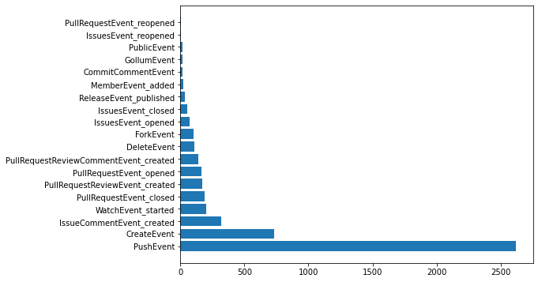

# The events API


<!-- WARNING: THIS FILE WAS AUTOGENERATED! DO NOT EDIT! -->

``` python
api = GhApi()
```

------------------------------------------------------------------------

<a href="https://github.com/fastai/ghapi/blob/master/ghapi/event.py#L45"
target="_blank" style="float:right; font-size:smaller">source</a>

### GhApi.list_events

>      GhApi.list_events (per_page=30, page=1, username=None, org=None,
>                         owner=None, repo=None)

*Fetch public events for repo network, org, user, or all*

------------------------------------------------------------------------

<a href="https://github.com/fastai/ghapi/blob/master/ghapi/event.py#L53"
target="_blank" style="float:right; font-size:smaller">source</a>

### GhApi.list_events_parallel

>      GhApi.list_events_parallel (per_page=30, n_pages=8, username=None,
>                                  org=None, owner=None, repo=None)

*Fetch as many events from `list_events` in parallel as available*

`list_events` and `list_events_parallel` support the following:

<table>
<colgroup>
<col style="width: 50%" />
<col style="width: 50%" />
</colgroup>
<thead>
<tr class="header">
<th style="text-align: left;">Events from</th>
<th style="text-align: left;">Example</th>
</tr>
</thead>
<tbody>
<tr class="odd">
<td style="text-align: left;">Organization</td>
<td
style="text-align: left;"><code>api.list_events_parallel(org='fastai')</code></td>
</tr>
<tr class="even">
<td style="text-align: left;">User</td>
<td
style="text-align: left;"><code>api.list_events_parallel(username='jph00')</code></td>
</tr>
<tr class="odd">
<td style="text-align: left;">Repository network</td>
<td
style="text-align: left;"><code>api.list_events_parallel(owner='fastai', repo='fastcore')</code></td>
</tr>
<tr class="even">
<td style="text-align: left;">All public</td>
<td
style="text-align: left;"><code>api.list_events_parallel()</code></td>
</tr>
</tbody>
</table>

------------------------------------------------------------------------

<a href="https://github.com/fastai/ghapi/blob/master/ghapi/event.py#L66"
target="_blank" style="float:right; font-size:smaller">source</a>

#### GhEvent

*Class for events returned from \`fetch_events*

``` python
print([snake2camel(o)+'Event' for o in Event])
```

    ['PageBuildEvent', 'ContentReferenceEvent', 'RepositoryImportEvent', 'CreateEvent', 'WorkflowRunEvent', 'DeleteEvent', 'OrganizationEvent', 'SponsorshipEvent', 'ProjectColumnEvent', 'PushEvent', 'ContextEvent', 'MilestoneEvent', 'ProjectCardEvent', 'ProjectEvent', 'PackageEvent', 'PullRequestEvent', 'RepositoryDispatchEvent', 'TeamAddEvent', 'WorkflowDispatchEvent', 'MemberEvent', 'MetaEvent', 'CodeScanningAlertEvent', 'PublicEvent', 'NeedsEvent', 'CheckRunEvent', 'SecurityAdvisoryEvent', 'PullRequestReviewCommentEvent', 'OrgBlockEvent', 'CommitCommentEvent', 'WatchEvent', 'MarketplacePurchaseEvent', 'StarEvent', 'InstallationRepositoriesEvent', 'CheckSuiteEvent', 'GithubAppAuthorizationEvent', 'TeamEvent', 'StatusEvent', 'RepositoryVulnerabilityAlertEvent', 'PullRequestReviewEvent', 'LabelEvent', 'InstallationEvent', 'ReleaseEvent', 'IssuesEvent', 'RepositoryEvent', 'GollumEvent', 'MembershipEvent', 'DeploymentEvent', 'DeployKeyEvent', 'IssueCommentEvent', 'PingEvent', 'DeploymentStatusEvent', 'ForkEvent', 'ScheduleEvent']

------------------------------------------------------------------------

<a href="https://github.com/fastai/ghapi/blob/master/ghapi/event.py#L89"
target="_blank" style="float:right; font-size:smaller">source</a>

### GhApi.fetch_events

>      GhApi.fetch_events (n_pages=3, pause=0.4, per_page=30, types=None,
>                          incl_bot=False, username=None, org=None, owner=None,
>                          repo=None)

*Generate an infinite stream of events, optionally filtered to
`types, with`pause\` seconds between requests*

------------------------------------------------------------------------

<a
href="https://github.com/fastai/ghapi/blob/master/ghapi/event.py#L102"
target="_blank" style="float:right; font-size:smaller">source</a>

### load_sample_events

>      load_sample_events ()

*Load sample events, downloading if needed*

------------------------------------------------------------------------

<a
href="https://github.com/fastai/ghapi/blob/master/ghapi/event.py#L113"
target="_blank" style="float:right; font-size:smaller">source</a>

### save_sample_events

>      save_sample_events (n=5000)

*Save the most recent `n` events as compressed JSON*

5000 sample events (taken from a single recent period) are available,
and are downloaded and cached by
[`load_sample_events`](https://ghapi.fast.ai/event.html#load_sample_events).
`full_type` provides the combination of `type` and `payload.action`
(where available) for each event. Here’s the frequency of all
`full_types` in the sample:

``` python
evts = load_sample_events()
x,y = zip(*Counter([o.full_type for o in evts]).most_common())
plt.figure(figsize=(8, 6))
plt.barh(x,y);
```



You can use the `description`, `text`, and `emoji` properties to display
events, e.g:

``` python
exs = [first(evts, risinstance(o)) for o in described_evts]

def _fmt_evt(o):
    res = f'{o.emoji} **{o.actor.login}** ' + truncstr(f'{o.description} *{o.repo.name}',60) + '*'
    if o.text: res += f': "{truncstr(o.text, 50)}"'
    return res.replace('\n',' ')

Markdown('|Type|Description|\n|:--|:--|\n' +
         '\n'.join(f'|{camel2words(o.type.replace("PullRequest","PR ")[:-5])}|{_fmt_evt(o)}|' for o in exs))
```

<table>
<colgroup>
<col style="width: 50%" />
<col style="width: 50%" />
</colgroup>
<thead>
<tr class="header">
<th style="text-align: left;">Type</th>
<th style="text-align: left;">Description</th>
</tr>
</thead>
<tbody>
<tr class="odd">
<td style="text-align: left;">Push</td>
<td style="text-align: left;">⭐ <strong>fedya</strong> pushed 1 commits
to “rolling” in <em>OpenMandrivaAssociation/g…</em></td>
</tr>
<tr class="even">
<td style="text-align: left;">Delete</td>
<td style="text-align: left;">✂ <strong>dependabot[bot]</strong> deleted
branch “packit-0.5.0” in <em>paketo-buildpacks/occam</em></td>
</tr>
<tr class="odd">
<td style="text-align: left;">Create</td>
<td style="text-align: left;">🏭 <strong>github-classroom[bot]</strong>
created repository in <em>Introduction-to-Programming-OSOWSKI/…</em>:
“1-5-add-two-numbers-noraahlman23 created by GitHu…”</td>
</tr>
<tr class="even">
<td style="text-align: left;">PR</td>
<td style="text-align: left;">📬 <strong>JerryMacedoCastro</strong>
opened PR #1 on <em>JerryMacedoCastro/tb-arquitetura-js</em>: “Input
component created”</td>
</tr>
<tr class="odd">
<td style="text-align: left;">Member</td>
<td style="text-align: left;">💃 <strong>github-classroom[bot]</strong>
added member noraahlman23 in
<em>Introduction-to-Programming-O…</em></td>
</tr>
<tr class="even">
<td style="text-align: left;">Public</td>
<td style="text-align: left;">♥ <strong>navikt</strong> made public repo
<em>navikt/syfoinntektsmelding</em></td>
</tr>
<tr class="odd">
<td style="text-align: left;">PR Review Comment</td>
<td style="text-align: left;">🗨 <strong>fruttasecca</strong> created
review comment on PR #97 in <em>orchest/orchest</em>: “Does this make it
so that users coming from an ol…”</td>
</tr>
<tr class="even">
<td style="text-align: left;">Fork</td>
<td style="text-align: left;">🍽 <strong>amin-lotf</strong> forked
<em>vinaygaba/Learn-Jetpack-Compose-By-Example</em>: “🚀 This project
contains various examples that sho…”</td>
</tr>
<tr class="odd">
<td style="text-align: left;">Commit Comment</td>
<td style="text-align: left;">🎉 <strong>vercel[bot]</strong> created
commint comment in <em>Samaraferreira/test-frontend</em>: “Successfully
deployed to the following URLs: * […”</td>
</tr>
<tr class="even">
<td style="text-align: left;">Watch</td>
<td style="text-align: left;">👀 <strong>ikarius</strong> started
watching <em>jorgebucaran/awsm.fish</em></td>
</tr>
<tr class="odd">
<td style="text-align: left;">PR Review</td>
<td style="text-align: left;">💌 <strong>fruttasecca</strong> created PR
review in <em>orchest/orchest</em></td>
</tr>
<tr class="even">
<td style="text-align: left;">Release</td>
<td style="text-align: left;">🚀 <strong>github-actions[bot]</strong>
published release v1.1.3 in <em>vouv/srun</em></td>
</tr>
<tr class="odd">
<td style="text-align: left;">Issues</td>
<td style="text-align: left;">🐛 <strong>efritz</strong> opened issue
#16915 on <em>sourcegraph/sourcegraph</em>: “auto-indexing: Add
docker/src-cli command wall cl…”</td>
</tr>
<tr class="even">
<td style="text-align: left;">Gollum</td>
<td style="text-align: left;">📚 <strong>TradingToolCrypto</strong>
created wiki page in <em>TradingToolCrypto/TradingTool-Wiki</em></td>
</tr>
<tr class="odd">
<td style="text-align: left;">Issue Comment</td>
<td style="text-align: left;">💬 <strong>jerhard</strong> created
comment on issue #2570 in <em>ls1intum/Artemis</em>: “Do you think that
spaces (or even white space cha…”</td>
</tr>
</tbody>
</table>
